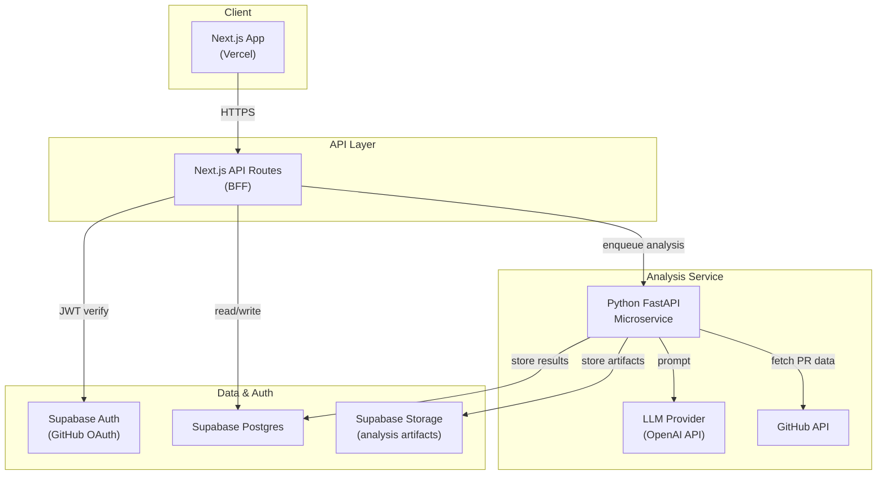
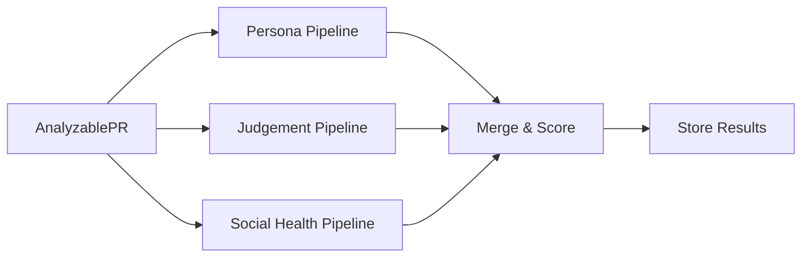
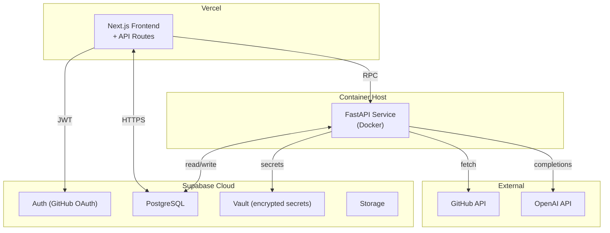

# ReviewSense AI — Technical Design & Architecture

## 1. System Architecture Overview



### Stack Summary

| Layer | Technology | Hosting |
|-------|-----------|---------|
| Frontend | Next.js 14+ (React, TypeScript) | Vercel |
| BFF / API | Next.js API Routes (Edge + Node runtimes) | Vercel |
| Auth | Supabase Auth (GitHub OAuth provider) | Supabase |
| Database | Supabase Postgres | Supabase |
| File Storage | Supabase Storage | Supabase |
| Analysis Service | Python 3.12+, FastAPI, Pydantic v2 | Railway / Fly.io / Cloud Run |
| LLM | OpenAI API (GPT-4o) via adapter pattern | External |
| VCS Integration | GitHub REST API v3 + GraphQL v4 | External |

---

## 2. End-to-End Data Flow

```
┌─────────────┐     ┌───────────────┐     ┌──────────────────┐
│  User pastes │────▶│ Next.js BFF   │────▶│ Supabase         │
│  PR URL      │     │ validates URL │     │ check quota &    │
│              │     │ + auth check  │     │ dedup            │
└─────────────┘     └──────┬────────┘     └──────────────────┘
                           │
                    ┌──────▼────────┐
                    │ POST /analyze │
                    │ to FastAPI    │
                    └──────┬────────┘
                           │
              ┌────────────▼────────────┐
              │ 1. Fetch PR from GitHub │
              │    (diff, comments,     │
              │     reviews, metadata)  │
              └────────────┬────────────┘
                           │
              ┌────────────▼────────────┐
              │ 2. Normalize into       │
              │    AnalyzablePR schema  │
              └────────────┬────────────┘
                           │
         ┌─────────────────┼─────────────────┐
         │                 │                 │
    ┌────▼─────┐     ┌────▼─────┐     ┌────▼──────┐
    │ Persona  │     │ Reviewer │     │ Social    │
    │ Reaction │     │ Judgement│     │ Health    │
    │ Analysis │     │ Analysis │     │ Scoring   │
    └────┬─────┘     └────┬─────┘     └────┬──────┘
         │                │                 │
         └────────────────┼─────────────────┘
                          │
              ┌───────────▼──────────┐
              │ 3. Assemble verdict  │
              │    + scores + cards  │
              └───────────┬──────────┘
                          │
              ┌───────────▼──────────┐
              │ 4. Store in Supabase │
              │    (pr_analyses,     │
              │     reviewer_stats)  │
              └───────────┬──────────┘
                          │
              ┌───────────▼──────────┐
              │ 5. Return results    │
              │    to BFF → Client   │
              └──────────────────────┘
```

### Step Details

| Step | Actor | Description |
|------|-------|-------------|
| **Initiate** | BFF | Validates PR URL format, authenticates user via Supabase JWT, checks rate limit quota, creates a pending `pr_analyses` row, sends async request to FastAPI |
| **Fetch** | FastAPI | Uses stored GitHub OAuth token to call GitHub API — fetches PR metadata, diff stats, review comments, review states, file list |
| **Normalize** | FastAPI | Maps GitHub API response into `AnalyzablePR` Pydantic model — strips unnecessary fields, computes derived metrics (diff_size, file_categories, comment_density) |
| **Analyze** | FastAPI | Runs three parallel analysis pipelines via LLM prompts: persona reactions, reviewer judgement, social health scoring |
| **Assemble** | FastAPI | Merges pipeline outputs, computes composite scores, determines VETO/PAUSE/CLEAR verdict |
| **Store** | FastAPI | Writes completed analysis to `pr_analyses`, updates rolling aggregates in `reviewer_stats` |
| **Return** | BFF | Polls or receives webhook from FastAPI, returns full analysis payload to frontend for rendering |

---

## 3. Supabase Data Model

### 3.1 Core Tables

```sql
-- Users (extends Supabase Auth)
CREATE TABLE public.profiles (
    id              UUID PRIMARY KEY REFERENCES auth.users(id),
    github_username TEXT NOT NULL UNIQUE,
    display_name    TEXT,
    avatar_url      TEXT,
    created_at      TIMESTAMPTZ DEFAULT now(),
    updated_at      TIMESTAMPTZ DEFAULT now()
);

-- Organizations (GitHub orgs)
CREATE TABLE public.organizations (
    id              UUID PRIMARY KEY DEFAULT gen_random_uuid(),
    github_org_id   BIGINT NOT NULL UNIQUE,
    name            TEXT NOT NULL,
    slug            TEXT NOT NULL UNIQUE,
    created_at      TIMESTAMPTZ DEFAULT now()
);

-- Org membership
CREATE TABLE public.org_members (
    org_id      UUID REFERENCES public.organizations(id) ON DELETE CASCADE,
    user_id     UUID REFERENCES public.profiles(id) ON DELETE CASCADE,
    role        TEXT NOT NULL DEFAULT 'member' CHECK (role IN ('owner', 'admin', 'member')),
    joined_at   TIMESTAMPTZ DEFAULT now(),
    PRIMARY KEY (org_id, user_id)
);

-- Repositories
CREATE TABLE public.repos (
    id              UUID PRIMARY KEY DEFAULT gen_random_uuid(),
    org_id          UUID REFERENCES public.organizations(id) ON DELETE CASCADE,
    github_repo_id  BIGINT NOT NULL UNIQUE,
    name            TEXT NOT NULL,
    full_name       TEXT NOT NULL,       -- e.g., "org/repo"
    default_branch  TEXT DEFAULT 'main',
    is_active       BOOLEAN DEFAULT true,
    created_at      TIMESTAMPTZ DEFAULT now()
);

-- Pull Requests (cached metadata)
CREATE TABLE public.pull_requests (
    id              UUID PRIMARY KEY DEFAULT gen_random_uuid(),
    repo_id         UUID REFERENCES public.repos(id) ON DELETE CASCADE,
    github_pr_id    BIGINT NOT NULL,
    number          INT NOT NULL,
    title           TEXT NOT NULL,
    author_username TEXT NOT NULL,
    state           TEXT NOT NULL,        -- open, closed, merged
    diff_stats      JSONB,               -- {additions, deletions, changed_files}
    created_at      TIMESTAMPTZ,
    merged_at       TIMESTAMPTZ,
    fetched_at      TIMESTAMPTZ DEFAULT now(),
    UNIQUE (repo_id, number)
);

-- PR Analyses (one per analysis run)
CREATE TABLE public.pr_analyses (
    id                  UUID PRIMARY KEY DEFAULT gen_random_uuid(),
    pr_id               UUID REFERENCES public.pull_requests(id) ON DELETE CASCADE,
    requested_by        UUID REFERENCES public.profiles(id),
    status              TEXT NOT NULL DEFAULT 'pending'
                        CHECK (status IN ('pending', 'processing', 'completed', 'failed')),
    social_health_score SMALLINT CHECK (social_health_score BETWEEN 0 AND 100),
    score_breakdown     JSONB,           -- {tone, clarity, psych_safety, engagement}
    persona_reactions   JSONB,           -- array of persona card objects
    reviewer_verdicts   JSONB,           -- array of {reviewer, verdict, flags, score}
    tone_rewrites       JSONB,           -- array of {original, rewritten, flag}
    error_message       TEXT,
    ai_model_used       TEXT,
    prompt_version      TEXT,
    latency_ms          INT,
    created_at          TIMESTAMPTZ DEFAULT now(),
    completed_at        TIMESTAMPTZ
);

-- Reviewer Stats (rolling aggregates per reviewer per org)
CREATE TABLE public.reviewer_stats (
    id                  UUID PRIMARY KEY DEFAULT gen_random_uuid(),
    org_id              UUID REFERENCES public.organizations(id) ON DELETE CASCADE,
    reviewer_username   TEXT NOT NULL,
    total_reviews       INT DEFAULT 0,
    approval_rate       NUMERIC(5,4),    -- 0.0000 to 1.0000
    avg_comment_depth   NUMERIC(6,2),    -- avg comments per review
    rubber_stamp_rate   NUMERIC(5,4),    -- % of approvals with <N comments
    domain_coverage     JSONB,           -- {file_pattern: review_count}
    avg_social_score    NUMERIC(5,2),
    avg_judgement_score NUMERIC(5,2),
    verdict_history     JSONB,           -- {veto: N, pause: N, clear: N}
    last_updated        TIMESTAMPTZ DEFAULT now(),
    UNIQUE (org_id, reviewer_username)
);

-- Team Norms (per-org configuration)
CREATE TABLE public.team_norms (
    id                  UUID PRIMARY KEY DEFAULT gen_random_uuid(),
    org_id              UUID REFERENCES public.organizations(id) ON DELETE CASCADE,
    max_pr_lines        INT DEFAULT 500,
    min_comments_per_100loc INT DEFAULT 2,
    tone_sensitivity    TEXT DEFAULT 'medium'
                        CHECK (tone_sensitivity IN ('low', 'medium', 'high')),
    required_reviewers  INT DEFAULT 1,
    bias_threshold      NUMERIC(5,4) DEFAULT 0.8000,
    custom_config       JSONB DEFAULT '{}',
    updated_by          UUID REFERENCES public.profiles(id),
    updated_at          TIMESTAMPTZ DEFAULT now(),
    UNIQUE (org_id)
);

-- OAuth tokens (encrypted, for GitHub API access)
CREATE TABLE public.oauth_tokens (
    user_id         UUID PRIMARY KEY REFERENCES public.profiles(id) ON DELETE CASCADE,
    provider        TEXT NOT NULL DEFAULT 'github',
    access_token    TEXT NOT NULL,       -- encrypted at rest via Supabase vault
    refresh_token   TEXT,
    scopes          TEXT[],
    expires_at      TIMESTAMPTZ,
    updated_at      TIMESTAMPTZ DEFAULT now()
);
```

### 3.2 Row-Level Security (RLS) Policies

```sql
-- Profiles: users can read all profiles, update only their own
ALTER TABLE public.profiles ENABLE ROW LEVEL SECURITY;
CREATE POLICY profiles_select ON public.profiles FOR SELECT USING (true);
CREATE POLICY profiles_update ON public.profiles FOR UPDATE USING (auth.uid() = id);

-- Org members: visible to members of the same org
ALTER TABLE public.org_members ENABLE ROW LEVEL SECURITY;
CREATE POLICY org_members_select ON public.org_members FOR SELECT
    USING (user_id = auth.uid() OR org_id IN (
        SELECT org_id FROM public.org_members WHERE user_id = auth.uid()
    ));

-- PR analyses: visible to requester + org members
ALTER TABLE public.pr_analyses ENABLE ROW LEVEL SECURITY;
CREATE POLICY analyses_select ON public.pr_analyses FOR SELECT
    USING (requested_by = auth.uid() OR EXISTS (
        SELECT 1 FROM public.pull_requests pr
        JOIN public.repos r ON r.id = pr.repo_id
        JOIN public.org_members om ON om.org_id = r.org_id
        WHERE pr.id = pr_analyses.pr_id AND om.user_id = auth.uid()
    ));

-- Reviewer stats: visible to org members, individual detail only to self
ALTER TABLE public.reviewer_stats ENABLE ROW LEVEL SECURITY;
CREATE POLICY reviewer_stats_select ON public.reviewer_stats FOR SELECT
    USING (org_id IN (
        SELECT org_id FROM public.org_members WHERE user_id = auth.uid()
    ));

-- Team norms: readable by org members, writable by owner/admin
ALTER TABLE public.team_norms ENABLE ROW LEVEL SECURITY;
CREATE POLICY norms_select ON public.team_norms FOR SELECT
    USING (org_id IN (
        SELECT org_id FROM public.org_members WHERE user_id = auth.uid()
    ));
CREATE POLICY norms_update ON public.team_norms FOR UPDATE
    USING (org_id IN (
        SELECT org_id FROM public.org_members
        WHERE user_id = auth.uid() AND role IN ('owner', 'admin')
    ));
```

### 3.3 Schema Versioning
- Migrations managed via **Supabase CLI** (`supabase migration new`, `supabase db push`)
- Each migration file is timestamped and stored in `supabase/migrations/`
- CI pipeline runs `supabase db diff` to detect drift between local and remote

---

## 4. Scoring Algorithms

### 4.1 Social Health Score (0–100)

```
SocialHealthScore = (
    tone_score      * 0.40 +
    clarity_score   * 0.25 +
    psych_safety    * 0.20 +
    engagement_bal  * 0.15
)
```

| Dimension | Source | Methodology |
|-----------|--------|-------------|
| **Tone** (0–100) | LLM analysis of each comment | Prompt-based classification: politeness, constructiveness, empathy. Averaged across all review comments. |
| **Clarity** (0–100) | LLM analysis | Specificity, actionability, context-providing. Penalizes vague comments ("LGTM", "fix this"). |
| **Psych Safety** (0–100) | LLM analysis | Checks for blame-free language, question framing, growth mindset indicators. Penalizes commands, sarcasm, dismissiveness. |
| **Engagement Balance** (0–100) | Computed | Gini coefficient of comment distribution across reviewers. Perfect balance = 100, single reviewer = lower score. |

### 4.2 Reviewer Judgement Score (0–100, per reviewer)

```
JudgementScore = (
    domain_coverage     * 0.30 +
    bias_indicator      * 0.25 +
    review_depth        * 0.25 +
    confidence_calib    * 0.20
)
```

| Dimension | Source | Methodology |
|-----------|--------|-------------|
| **Domain Coverage** (0–100) | Computed from `reviewer_stats.domain_coverage` | Compare changed files' directories/extensions against reviewer's historical review file patterns. High overlap = high score. |
| **Bias Indicator** (0–100) | Computed from `reviewer_stats` | Inverse of bias signals: author favoritism rate, rubber-stamp rate. No bias = 100. |
| **Review Depth** (0–100) | Computed | comment_count / (diff_lines / 100), normalized against team norms. |
| **Confidence Calibration** (0–100) | Computed from history | Approval rate adjusted by post-merge issue rate (reverts, hotfixes within 48h). High approval + low issues = high score. |

### 4.3 Verdict Logic

```python
def compute_verdict(flags: list[Flag]) -> Verdict:
    high_count = sum(1 for f in flags if f.severity == "high")
    medium_count = sum(1 for f in flags if f.severity == "medium")

    if high_count >= 2:
        return Verdict.VETO
    if high_count >= 1 or medium_count >= 2:
        return Verdict.PAUSE
    return Verdict.CLEAR
```

---

## 5. GitHub Integration

### 5.1 Authentication
- **GitHub OAuth App** — for user authentication via Supabase Auth
- **GitHub App** (installed per org) — for repo/PR data access with fine-grained permissions

### 5.2 Required Permissions (GitHub App)
| Permission | Access | Purpose |
|-----------|--------|---------|
| Pull requests | Read | Fetch PR metadata, diff, comments |
| Repository contents | Read | Determine file categories for domain mapping |
| Organization members | Read | Map reviewers to org membership |
| Metadata | Read | Required baseline |

### 5.3 Data Fetching Strategy
- **On-demand**: PR data fetched when user requests analysis (no persistent webhooks for MVP)
- **Caching**: PR metadata cached in `pull_requests` table; re-fetched if analysis requested and cache > 5 minutes old
- **Rate limit awareness**: GitHub API rate limits tracked in-memory; back off with exponential delay when approaching limits

---

## 6. AI Service Architecture

### 6.1 LLM Interaction Pattern
- All LLM calls go through an **adapter interface** (`LLMClient` protocol)
- Default implementation: `OpenAIClient` using `gpt-4o`
- Prompt templates stored as versioned files in `app/prompts/`
- Each prompt includes: system context, structured output schema (JSON mode), few-shot examples
- Response validation via Pydantic models before use

### 6.2 Analysis Pipelines (parallel execution)



- **Persona Pipeline**: 1 LLM call per persona (3 calls, parallelized)
- **Judgement Pipeline**: 1 LLM call for bias/coverage analysis + 1 deterministic computation for stats-based flags
- **Social Health Pipeline**: 1 LLM call for tone/clarity/psych-safety + 1 deterministic computation for engagement balance

### 6.3 Rate Limiting & Quotas
- Per-user: 50 analyses/day (configurable via `team_norms.custom_config`)
- Per-org: 200 analyses/day
- LLM token budget: tracked per analysis, capped at 20K tokens/analysis
- Circuit breaker: if LLM error rate > 50% over 5-minute window, pause new analyses and return cached/partial results

---

## 7. Infrastructure & Deployment



### Environment Configuration
- **Vercel**: `NEXT_PUBLIC_SUPABASE_URL`, `NEXT_PUBLIC_SUPABASE_ANON_KEY`, `ANALYSIS_SERVICE_URL`, `ANALYSIS_SERVICE_API_KEY`
- **FastAPI Service**: `SUPABASE_URL`, `SUPABASE_SERVICE_KEY`, `OPENAI_API_KEY`, `GITHUB_APP_PRIVATE_KEY`, `GITHUB_APP_ID`
- All secrets managed via platform-native secret stores; `.env.example` checked into repo with placeholder values
