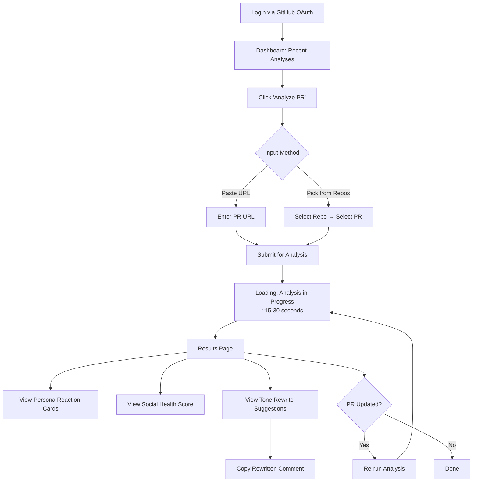
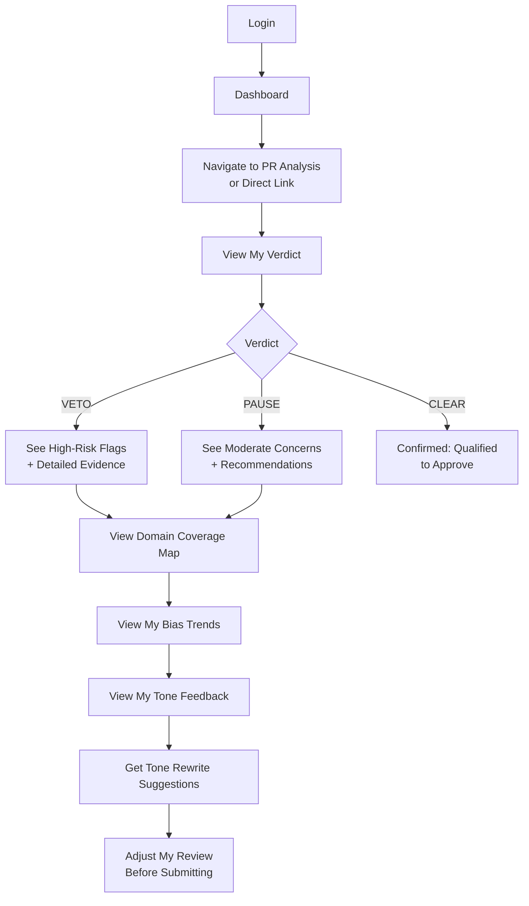
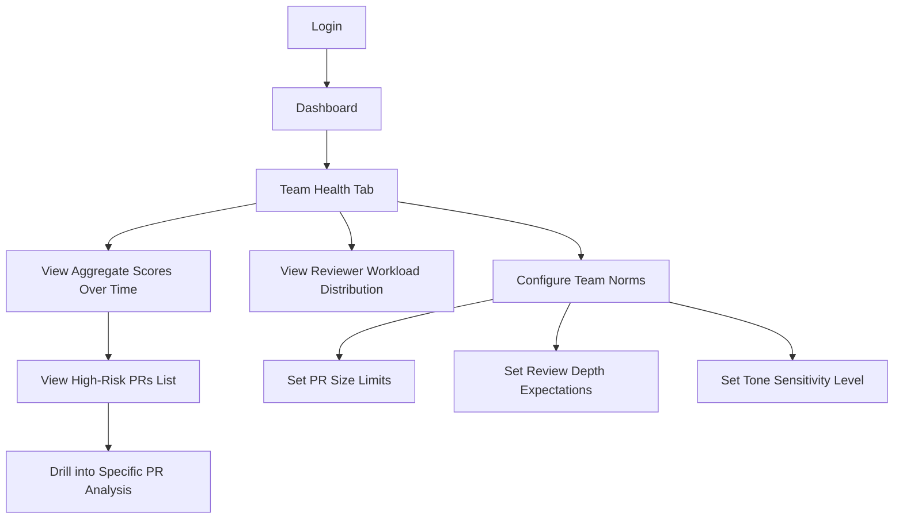

# ReviewSense AI — User Flows & UX Outlines

## 1. PR Author Flow

> *"How will this review land on my team?"*

### Screen-by-Screen

| Screen | Key Elements | Phase |
|--------|-------------|-------|
| **Login** | GitHub OAuth button, product tagline, value prop cards | Phase 0 |
| **Dashboard** | Recent analyses list (PR title, score badges, date), "Analyze PR" CTA button | Phase 0 |
| **Analyze Input** | URL text field with validation, OR connected-repo dropdown + PR picker | Phase 0 (URL only), Phase 1 (repo picker) |
| **Loading State** | Animated progress with step indicators (Fetching → Analyzing → Scoring), estimated time | Phase 0 |
| **Results: Persona Cards** | 3 cards in a grid. Each: persona avatar + name, emotional reaction emoji, clarity score bar, friction risk badge, 2–3 sentence narrative | Phase 0 |
| **Results: Social Health** | Radial gauge (0–100), 4 sub-dimension bars (tone, clarity, psych safety, engagement), overall interpretation text | Phase 0 |
| **Results: Tone Rewrites** | Expandable list of flagged comments. Each: original text (red-tinted), rewrite (green-tinted), fraud risk badge, "Copy" button | Phase 1 |
| **Results: Delta View** | Side-by-side score comparison between analysis runs | Phase 1 |

---

## 2. Senior Reviewer Flow

> *"Am I actually qualified to approve this PR right now?"*

### Screen-by-Screen

| Screen | Key Elements | Phase |
|--------|-------------|-------|
| **My Verdict** | Large VETO/PAUSE/CLEAR badge with color coding (red/amber/green). Below: list of flags with severity icons, evidence summary, and "why we flagged this" explanation | Phase 0 |
| **Domain Coverage Map** | File tree or heatmap of changed files. Color: green (reviewed similar files before), yellow (partial overlap), red (no history). Total coverage % | Phase 1 |
| **Bias Trends** | Sparkline charts: approval rate over last 30 reviews, comment depth trend, rubber-stamp rate, author-specific approval rates. Compared to team median | Phase 1 |
| **Tone Feedback** | My comments flagged for friction risk. Each with: friction level, original text, suggested rewrite, "Apply" action | Phase 1 |
| **Reviewer Profile** | Personal page showing aggregate stats, domain strengths, recent verdicts, improvement trend | Phase 2 |

### Key UX Principles for Reviewer Flow
- **Non-punitive framing**: VETO is "We recommend a second pair of eyes" not "You are unqualified"
- **Evidence-based**: Every flag links to specific data (e.g., "You've approved 14 of 15 PRs from this author")
- **Actionable**: Each flag includes a concrete suggestion (e.g., "Consider requesting review from someone who has worked in `infra/` recently")

---

## 3. Team Lead / EM Flow

> *"Where is our review culture deteriorating?"*

### Screen-by-Screen

| Screen | Key Elements | Phase |
|--------|-------------|-------|
| **Team Health Overview** | Time-series chart of avg Social Health Score and avg Judgement Score (30/60/90 day views). Trend arrows. Aggregate verdict distribution pie chart (VETO/PAUSE/CLEAR %) | Phase 1 |
| **High-Risk PRs** | Filterable table: PR title, author, reviewer(s), verdict(s), social score, date, merge status. Sort by risk. Highlight: PRs merged despite VETO/PAUSE | Phase 1 |
| **Reviewer Workload** | Horizontal bar chart: reviews per person over selected period. Color-coded by avg verdict quality. No individual shaming — shows distribution balance | Phase 1 |
| **Team Norms Config** | Form: max PR size slider, min comment depth slider, tone sensitivity toggle (low/medium/high), required reviewer count. Save with audit trail | Phase 1 |
| **Anonymous Trend View** | All individual data anonymized — shows patterns without names. "3 reviewers showed increasing rubber-stamp rates" not "Alice showed..." | Phase 2 |

### Key UX Principles for Team Lead Flow
- **Aggregate only**: No individual scores on the team dashboard — only distributions and trends
- **Opt-in transparency**: Individual reviewers choose whether their name appears on team views
- **Guidance, not surveillance**: Dashboard framed as "review health check" not "performance monitoring"
- **Actionable**: Each trend links to a recommended intervention (e.g., "Consider pairing reviews for `infra/` PRs")

---

## 4. Phase Mapping Summary

| Feature | Phase 0 (Prototype) | Phase 1 (MVP) | Phase 2 (Pilot) |
|---------|---------------------|---------------|-----------------|
| **Login + GitHub OAuth** | ✅ | ✅ | ✅ |
| **Paste PR URL → Analysis** | ✅ | ✅ | ✅ |
| **Persona Reaction Cards** | ✅ (3 fixed personas) | ✅ | ✅ + configurable personas |
| **Social Health Score** | ✅ (basic) | ✅ (with breakdown) | ✅ |
| **VETO/PAUSE/CLEAR Verdict** | ✅ (basic) | ✅ (with flags) | ✅ |
| **Tone Rewrite Suggestions** | – | ✅ | ✅ |
| **Repo Picker (GitHub App)** | – | ✅ | ✅ |
| **Domain Coverage Map** | – | ✅ | ✅ |
| **Bias Trend Charts** | – | ✅ | ✅ |
| **Team Health Dashboard** | – | ✅ (basic) | ✅ (enhanced) |
| **Team Norms Config** | – | ✅ | ✅ |
| **Reviewer Workload View** | – | ✅ | ✅ |
| **Delta View (re-run)** | – | ✅ | ✅ |
| **Anonymous Trend View** | – | – | ✅ |
| **Configurable Personas** | – | – | ✅ |
| **Reviewer Profile Page** | – | – | ✅ |
| **Slack/Teams Notifications** | – | – | ✅ |
