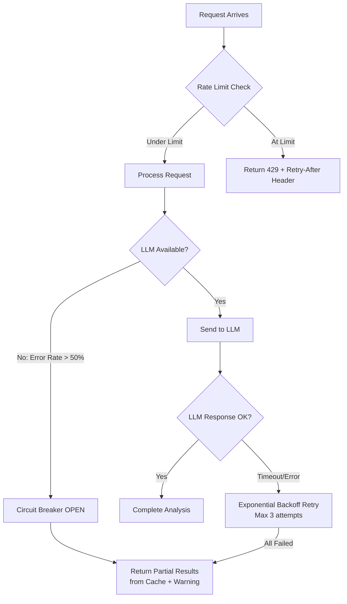

# ReviewSense AI — Security, Privacy & Guardrails

## 1. Secrets Management

### Rules
| Rule | Details |
|------|---------|
| **No hardcoded secrets** | Zero tolerance. No API keys, tokens, passwords, or connection strings in source code, config files checked into git, or log output |
| **Environment variables** | All secrets loaded from environment variables via `pydantic-settings` (Python) or `process.env` (Node.js) |
| **`.env.example`** | Checked into repo with all required variable names and placeholder values. Actual `.env` files are `.gitignored` |
| **Supabase Vault** | Long-lived secrets (GitHub App private key, LLM API keys) stored in Supabase Vault for programmatic access by the analysis service |
| **Rotation** | All API keys must be rotatable without downtime. Services read keys from env on each request or cache with short TTL (≤5 min) |
| **CI/CD secrets** | Stored in platform-native secret managers (Vercel Environment Variables, Railway Variables, GitHub Actions Secrets) |

### `.env.example` Template

```env
# Supabase
NEXT_PUBLIC_SUPABASE_URL=https://your-project.supabase.co
NEXT_PUBLIC_SUPABASE_ANON_KEY=your-anon-key
SUPABASE_SERVICE_ROLE_KEY=your-service-role-key

# Analysis Service
ANALYSIS_SERVICE_URL=http://localhost:8000
ANALYSIS_SERVICE_API_KEY=your-internal-api-key

# GitHub
GITHUB_APP_ID=123456
GITHUB_APP_PRIVATE_KEY_PATH=/path/to/private-key.pem
GITHUB_CLIENT_ID=your-client-id
GITHUB_CLIENT_SECRET=your-client-secret

# LLM
OPENAI_API_KEY=sk-your-key
OPENAI_MODEL=gpt-4o
OPENAI_MAX_TOKENS_PER_ANALYSIS=20000

# Rate Limits
RATE_LIMIT_PER_USER_DAILY=50
RATE_LIMIT_PER_ORG_DAILY=200
```

---

## 2. Rate Limiting & Back-Pressure

### Tiers

| Scope | Limit | Window | Enforcement Point |
|-------|-------|--------|-------------------|
| Per user | 50 analyses | 24h rolling | BFF API route |
| Per organization | 200 analyses | 24h rolling | BFF API route |
| Per IP (unauthenticated) | 10 requests | 1h | Vercel Edge Middleware |
| LLM token budget | 20,000 tokens | Per analysis | FastAPI service |
| GitHub API | 4,500 requests/hr | 1h (GitHub-enforced) | FastAPI client |

### Back-Pressure Strategy



- **Token bucket** for per-user/per-org limits (stored in Supabase or Redis)
- **Circuit breaker** for LLM provider: opens after 50% error rate in 5-minute window, half-opens after 60s
- **Queue** for burst traffic: analysis requests enqueued if >10 concurrent, processed FIFO
- **Exponential backoff** for GitHub API: initial 1s, max 30s, with jitter

---

## 3. Access Control & Authentication

### GitHub OAuth Scopes

| Scope | Justification |
|-------|--------------|
| `read:user` | Get user profile for display |
| `read:org` | List organizations for team features |
| `repo` (read-only via GitHub App) | Fetch PR data, diffs, comments |

> [!IMPORTANT]
> We use a **GitHub App** (not OAuth App) for repo access. GitHub Apps support fine-grained, per-repo permissions and don't require broad `repo` scope on the OAuth token.

### Supabase RLS Enforcement

| Table | Policy Summary |
|-------|---------------|
| `profiles` | All authenticated users can read; only self can update |
| `org_members` | Visible to members of the same org |
| `pr_analyses` | Visible to: requester, or any member of the PR's org |
| `reviewer_stats` | Org members can see aggregate stats; detailed individual stats visible only to the reviewer themselves |
| `team_norms` | Readable by org members; writable by org owners/admins only |
| `oauth_tokens` | Service role only — never exposed to client queries |

### Service-to-Service Auth
- BFF → FastAPI: API key in `Authorization: Bearer <key>` header
- FastAPI → Supabase: service role key (never exposed to frontend)
- All inter-service communication over HTTPS

---

## 4. Data Minimization & Privacy

### What We Store

| Data | Stored? | Retention | Justification |
|------|---------|-----------|--------------|
| PR metadata (title, number, author, file list) | ✅ | Until user deletes | Required for analysis history and trends |
| Review comments (text only) | ✅ | Until user deletes | Required for tone analysis and rewrite suggestions |
| Full diff content | ❌ | Not stored | Only diff stats (additions/deletions/files) are stored |
| Source code | ❌ | Not stored | Never fetched or cached |
| Analysis results (scores, verdicts, persona cards) | ✅ | Until user deletes | Core product value |
| Reviewer aggregate stats | ✅ | Rolling 90-day window | Trend calculations |
| OAuth tokens | ✅ (encrypted) | Until revoked | GitHub API access |

### Data Policies
- **Right to deletion**: Users can delete their profile and all associated data. Cascading deletes remove analyses, stats, and tokens
- **No training on customer data**: LLM API calls use `"training": false` flag (OpenAI). No customer PR data is used to fine-tune models
- **Anonymization**: Team-level dashboards show aggregate metrics only. Individual data visible only to the individual
- **Audit log**: All data access by admin/service roles is logged with timestamp and actor

---

## 5. Psychological Safety & Ethics

### Core Principles

> [!CAUTION]
> ReviewSense AI must **never** be used as a surveillance or punishment tool. Every design decision must reinforce this boundary.

| Principle | Implementation |
|-----------|---------------|
| **Guidance, not judgement** | All verdicts explicitly labeled: *"This is AI-assisted guidance. Use professional judgement."* Displayed on every analysis result |
| **Non-shaming language** | System prompts explicitly instruct LLM to avoid blame, sarcasm, and ranking language. Output validated before display |
| **Opt-in participation** | Reviewers are never enrolled without explicit consent. Individual stats visible only to the individual |
| **Aggregate leadership views** | Team leads see distributions and trends, never named individual scores. Exception: a reviewer can opt-in to visibility |
| **No performance coupling** | Explicitly documented: ReviewSense AI outputs must not be used in performance reviews, promotion decisions, or disciplinary actions |
| **Transparency** | Users can view the flags, evidence, and reasoning behind any verdict. No black-box scores |
| **Calibration disclaimer** | Scores include confidence intervals where possible (e.g., "74 ± 8") to communicate uncertainty |

### Forbidden Patterns

| ❌ Never Do | ✅ Instead |
|------------|-----------|
| "Alice is an unqualified reviewer" | "For this specific PR, we recommend a second reviewer with `infra/` experience" |
| Leaderboards ranking reviewers | Aggregate distributions without names |
| Auto-blocking PRs based on verdict | Advisory flags that humans act on |
| Surfacing individual scores to managers | Aggregate team trends with anonymous drill-down |
| "Your review is biased" | "We noticed a pattern — you've approved 14 of 15 PRs from this author. Consider if this PR warrants extra scrutiny" |

### Content Safety Filters
- LLM outputs are post-processed to detect and remove:
  - Naming/shaming language
  - Absolute/authoritative phrasing ("you must", "this is wrong")
  - Comparisons between individuals
  - Any content that could constitute harassment
- If filter detects issues, output is rewritten with softer framing before display
