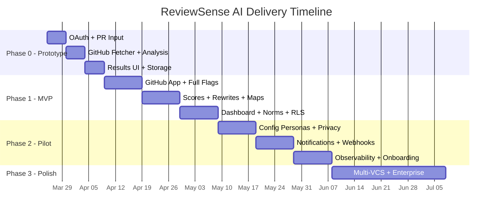

# ReviewSense AI — Phases & Milestones

---

## Phase 0: Prototype (Weeks 1–3)

> **Goal:** Validate the core analysis loop end-to-end. A user can paste a PR URL and see persona reactions + a basic verdict.

### Deliverables
| # | Deliverable | Details |
|---|------------|---------|
| P0-1 | GitHub OAuth login | Supabase Auth + GitHub provider |
| P0-2 | PR URL input form | Text field with URL validation, submit button |
| P0-3 | GitHub PR fetcher | Fetch PR metadata, diff stats, review comments via GitHub API |
| P0-4 | Basic persona reactions | 3 hardcoded personas, LLM-generated reactions (emotional reaction + narrative) |
| P0-5 | Basic Social Health Score | Tone + clarity sub-scores, simple weighted average |
| P0-6 | Basic VETO/PAUSE/CLEAR verdict | Flag-based verdict with 2–3 flag types (rubber-stamp, domain blind spot) |
| P0-7 | Results display page | Persona cards, score gauge, verdict badge with basic explanation |
| P0-8 | Supabase schema (core tables) | profiles, pull_requests, pr_analyses |

### Success Criteria
- User logs in, pastes a real GitHub PR URL, sees persona reactions and a verdict within 60 seconds
- Analysis results persist in the database and are viewable on refresh

### Infrastructure
- Next.js on Vercel (free tier)
- Supabase (free tier)
- FastAPI on Railway (hobby tier) or local Docker
- OpenAI API (pay-per-use)

---

## Phase 1: MVP (Weeks 4–9)

> **Goal:** Production-quality single-PR analysis with full verdict system, reviewer bias detection, tone rewrites, and basic team health dashboard.

### Deliverables
| # | Deliverable | Details |
|---|------------|---------|
| P1-1 | GitHub App integration | Install per-org, repo picker, fine-grained permissions |
| P1-2 | Full flag taxonomy | All 6 flag types: author favoritism, rubber-stamp, domain blind spot, risky file ignore, confidence gap, tone friction |
| P1-3 | Reviewer Judgement Score | Full 4-dimension composite score with breakdown |
| P1-4 | Social Health Score breakdown | All 4 sub-dimensions displayed with bars and explanations |
| P1-5 | Tone rewrite suggestions | Flagged comments → LLM-generated rewrites, copy button |
| P1-6 | Domain coverage map | Per-reviewer file coverage heatmap for the analyzed PR |
| P1-7 | Bias trend charts | Sparklines for approval rate, comment depth, rubber-stamp rate over last 30 reviews |
| P1-8 | Analysis history | List of past analyses with scores, filterable by date/repo |
| P1-9 | Team health dashboard | Aggregate score trends, high-risk PR list, reviewer workload bar chart |
| P1-10 | Team norms config | Settings page for PR size limits, review depth expectations, tone sensitivity |
| P1-11 | Rate limiting | Per-user and per-org quotas, 429 responses with retry guidance |
| P1-12 | RLS policies | All tables secured, tested |
| P1-13 | Delta view | Re-run analysis and see score changes |
| P1-14 | Error handling & loading states | Graceful degradation, progress indicators, actionable error messages |

### Success Criteria
- 5+ beta users analyze real PRs daily for 2 weeks
- <30s analysis time for PRs ≤500 changed lines
- Zero secrets in codebase (verified by CI scan)
- Rate limits enforced and tested
- All core tables have RLS policies

### Infrastructure Additions
- Supabase (Pro plan for production)
- FastAPI on Railway/Fly.io (production container)
- CI/CD pipeline (GitHub Actions)
- `.env.example` + CI secret validation

---

## Phase 2: Pilot (Weeks 10–15)

> **Goal:** Pilot with 2–3 real engineering teams. Add configurability, better privacy controls, and notification integrations.

### Deliverables
| # | Deliverable | Details |
|---|------------|---------|
| P2-1 | Configurable personas | Admin UI to create/edit personas with custom system prompts |
| P2-2 | Anonymous trend view | Team lead sees patterns ("3 reviewers show increasing rubber-stamp rates") without names |
| P2-3 | Reviewer profile page | Individual view with personal stats, domain strengths, improvement trends |
| P2-4 | Opt-in visibility controls | Reviewers choose whether their name appears on team-level views |
| P2-5 | Slack / Teams notifications | Notify on VETO/PAUSE verdicts (opt-in per user) |
| P2-6 | Webhook-triggered analysis | GitHub App webhook on `pull_request_review` events (auto-analyze) |
| P2-7 | Observability dashboard | Grafana with key metrics (analysis latency, error rates, verdict distribution) |
| P2-8 | Confidence intervals | Scores displayed with ±range to communicate uncertainty |
| P2-9 | Onboarding flow | New org setup wizard: install GitHub App → select repos → configure norms |
| P2-10 | Data export | Download analysis history as CSV/JSON |

### Success Criteria
- 2–3 teams using daily for 4+ weeks
- Positive feedback on psychological safety framing (survey)
- <5% rate limit complaints (quotas are sufficient)
- Webhook analysis latency <45s

---

## Phase 3: Polish & Scale (Weeks 16+)

> **Goal:** Enterprise readiness, multi-VCS support, advanced analytics.

### Deliverables
| # | Deliverable | Details |
|---|------------|---------|
| P3-1 | Multi-VCS support | GitLab, Bitbucket integration |
| P3-2 | SSO / SAML | Enterprise identity provider support |
| P3-3 | Custom LLM support | Bring-your-own-model (self-hosted or alternative providers) |
| P3-4 | Org-level analytics | Cross-team dashboards, review culture benchmarking |
| P3-5 | API access | Public REST API for CI/CD integration |
| P3-6 | Advanced bias detection | ML-based patterns beyond rule-based flags |
| P3-7 | Multi-language support | Non-English PR comment analysis |
| P3-8 | Compliance reporting | SOC 2 / GDPR readiness documentation |
| P3-9 | White-label / self-hosted option | Deployment guide for enterprise on-prem |

---

## Timeline Summary

---

## Risk Register

| Risk | Likelihood | Impact | Mitigation |
|------|-----------|--------|-----------|
| LLM costs exceed budget | Medium | High | Token budgets, caching, model downgrade fallback |
| GitHub API rate limits during busy analysis | Medium | Medium | Request caching, batch fetching, exponential backoff |
| Users perceive tool as surveillance | High | Critical | Psychological safety guardrails, opt-in design, aggregate-only leadership views, explicit disclaimers |
| LLM produces shaming/biased output | Medium | High | Post-processing filters, output validation, few-shot prompt tuning |
| Stale reviewer stats mislead verdicts | Low | Medium | 90-day rolling window, confidence intervals, recency weighting |
| Supabase free tier limits during prototype | Low | Low | Upgrade to Pro during Phase 1 transition |
